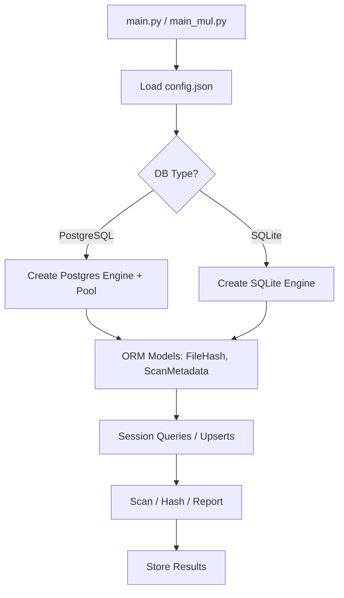

# Design: PostgreSQL and ORM Migration

## Overview
This design document details the architectural evolution for migrating dupFinder's database from SQLite (SQLAlchemy Core) to PostgreSQL (full SQLAlchemy ORM). The approach emphasizes modularity, configurability, and performance gains for concurrent operations, while preserving SQLite as a fallback. The design adheres to project conventions: single responsibility in utilities/, cross-platform compatibility via pathlib and standard libs, and no external network dependencies.

## Architectural Changes
### 1. Configuration Management
- **New Pattern**: Introduce a JSON-based configuration system (`config.json`) for database parameters. This decouples hardcoded settings from code, enabling runtime switching between backends without recompilation.
- **Implementation**:
  - Load config at startup in `utilities/database.py` using `json.load`.
  - Dynamic engine creation: For PostgreSQL, construct URL (`postgresql://{user}:{password}@{host}:{port}/{database}`); for SQLite, use file path.
  - CLI overrides (e.g., `--db-url`) via `argparse` for flexibility in scripts like `main.py`.
- **Rationale**: Supports project scalability (e.g., future cloud DBs) and user customization, aligning with constraints for local operations.

### 2. Database Backend Switch
- **From SQLite to PostgreSQL**:
  - PostgreSQL as default for its superior concurrency (MVCC), handling multiprocessing in `main_mul.py` without WAL pragmas.
  - Fresh DBs only; no migration tool to avoid complexity (users recreate data via rescan).
  - Optimizations: Connection pooling (`pool_size=20, max_overflow=30`) for high-throughput scans; indexes on `absolute_path` for fast lookups.
- **Fallback Mechanism**: Configurable type allows SQLite for low-resource environments, retaining existing schema compatibility.
- **Schema Evolution**: Use ORM's `declarative_base()` for models (`FileHash`, `ScanMetadata`), auto-generating tables via `Base.metadata.create_all`. Columns remain consistent (e.g., `scan_date` as Float epoch), but add Postgres-specific indexes.

### 3. ORM Adoption
- **From Core to ORM**:
  - Replace raw `Table`/`select`/`insert` with declarative models and session-based queries (e.g., `session.query(FileHash).filter_by(absolute_path=path)`).
  - Upserts via `session.merge()`; batches with `session.bulk_save_objects()` for efficiency.
  - Context manager `get_session()` yields scoped sessions, ensuring thread/process safety.
- **Multiprocessing Integration**: In `main_mul.py`, create engines per process to avoid shared state issues; dispose engines post-task.
- **Rationale**: ORM reduces boilerplate, improves readability (e.g., relationships if extended), and eases testing/mocking. Minimal overhead for dupFinder's query patterns.

### 4. Integration with Existing Components
- **utilities/database.py**: Central hub for config loading, model defs, and ORM functions (e.g., `upsert_files`, `get_pending_files`).
- **main.py / main_mul.py**: Delegate DB ops to utilities; add config loading and arg parsing.
- **utilities/html_generator.py**: Unchanged unless queries shift (e.g., use ORM for report data fetches).
- **Error Handling**: Centralized via SQLAlchemy exceptions (e.g., `OperationalError` for connections, `IntegrityError` for uniques); log with colorama.

## Trade-offs
- **Performance**:
  - Pros: PostgreSQL excels in concurrent writes (e.g., batch hash updates from multiple processes); pooling reduces latency.
  - Cons: Initial setup overhead (install/run Postgres server) vs. SQLite's zero-config. ORM adds ~5-10% overhead for simple inserts but pays off in maintainability.
- **Complexity**:
  - Pros: Config.json simplifies multi-env support; ORM enables future features (e.g., Analyzer queries).
  - Cons: Introduces psycopg2 dep (binary for easy install); users must manage Postgres creds. Mitigated by defaults and fallbacks.
- **Compatibility**:
  - Pros: Schema parity ensures report generation works unchanged.
  - Cons: No auto-migration; large existing SQLite DBs require manual rescan. Defer to user or future change.
- **Security**: Password in config.json (plain text); recommend env vars for production, but local-only per constraints.

## Relationships to Existing Specs
- **database-management**: Core impact—MODIFY requirements for backend-agnostic ops (e.g., add config loading, ORM queries); REMOVE SQLite-specific WAL; ADD PostgreSQL scenarios (e.g., pooling, indexes).
- **multiprocessing-support**: ENHANCE session handling for per-process engines.
- **scan-optimization**: BENEFIT from Postgres concurrency, but no direct schema changes.
- **No New Capabilities**: Config is internal; if externalized later, add configuration-management spec.
- **Cross-References**: Updated scenarios in database-management will reference file-discovery (paths) and hash-calculation (batch updates).

## Diagrams
### High-Level Architecture Flow

### ORM vs Core Comparison
- Core: Direct SQL (e.g., `conn.execute(insert_stmt)`).
- ORM: Object-oriented (e.g., `file = FileHash(path=..., hash=...); session.add(file)`).

This design ensures a robust, extensible foundation, with total changes confined to utilities/ and entry points.